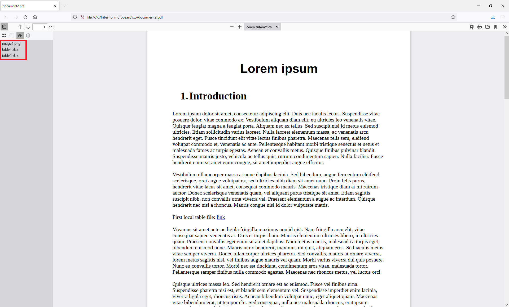

# pdf_hyperlink2attachment

In a pdf file, convert hyperlinks into attachments.


## TL;DR

__What?__ Get all the hyperlinks in a pdf file that reference local files and attach the files to the pdf.

__Why?__ This way a single pdf file can hold all the data. Also useful to attach data that does not "fit" a regular document layout (e.g.: very large tables, non-table and non-image files).

__How?__ `pdf_hyperlink2attachment.py input.pdf output.pdf`

## Introduction

This simple script does the following:

* Analyzes a pdf file (input).
* Gets all the hyperlinks in the pdf file that reference local files. Remote hyperlinks (e.g.: `http:`, `https:`, `ftp:`, `mailto:`) are ignored.
* Replaces the hyperlinks with attachments.
* Saves the data changes in a new pdf file (output).

With this, all the data is stored in a single pdf file. The user can then send a single file to someone over the internet instead of sending a zip/tar package with the original pdf and the files referenced by the hyperlinks.

## Requirements
The only "real" requirement is the [pikepdf](https://pikepdf.readthedocs.io/en/latest/) library. All the other requirements (e.g.: `os`, `pathlib`, `warnings`, `argparse`) are part of the standard python installation.

## How to use?

* Using Microsof Word or LibreOffice Writer, just highlight the desired text and insert an hyperlink to a local file.

* Export the `.docx` file to pdf. __Note:__ the pdf file should be exported, and not "printed" to pdf so the hyperlinks can be preserved.

* Run the script, e.g.:

```
$ pdf_hyperlink2attachment.py examples/document.pdf examples/document2.pdf
Input file: examples/document.pdf
  Attaching local file: 'examples/tables/table2.xlsx'
  Attaching local file: 'examples/tables/table1.xlsx'
  Attaching local file: 'examples/images/image1.png'
Output file: examples/document2.pdf
Done!
```

* Open the newly created file (e.g.: `document2.pdf`) with a pdf viewer and click on any hyperlink to access the data. This file does not depend of the local files (e.g.: `table1.xlsx`, `image1.png`) like the original pdf file (e.g.: `document.pdf`).

**_NOTE:_** Some pdf viewers (e.g.: Adobe Acrobat Reader, Firefox) show the attached files in the lateral bar, but this is not true for all viewers (e.g.: Evince). It is possible to attach files with the same name, but from different directories (e.g.: `dir1/myfile.txt`, `dir2/myfile.txt`). The respective hyperlinks will 
reference the correct attached files, however, the lateral attachment bar in pdf viewers (e.g. Adobe Acrobat Reader, Firefox) will only display the first of the homonymous files.


